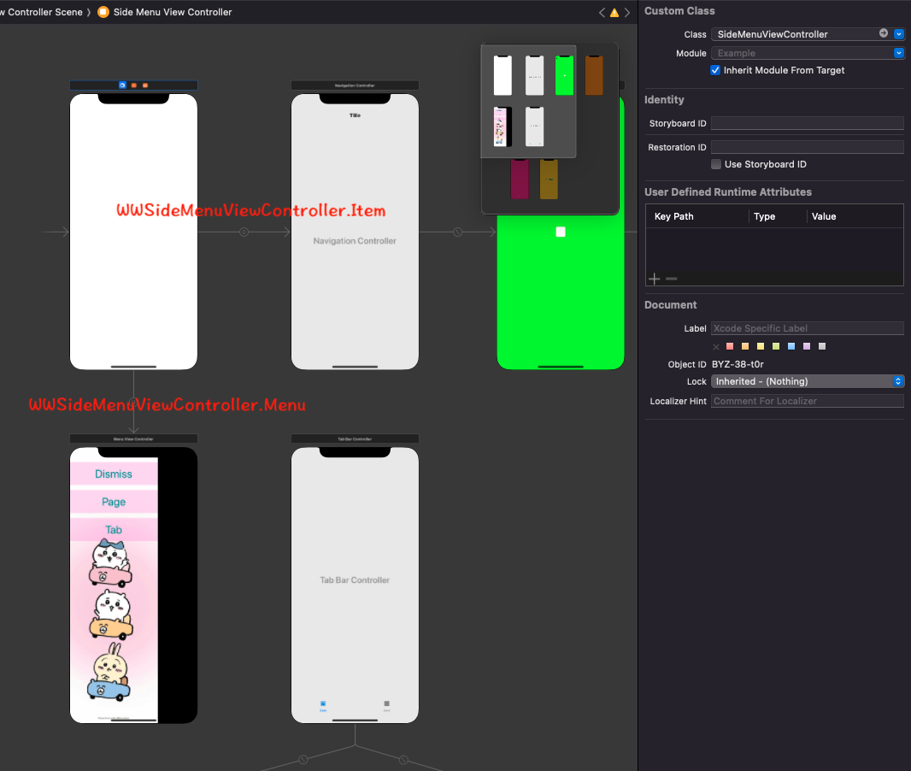
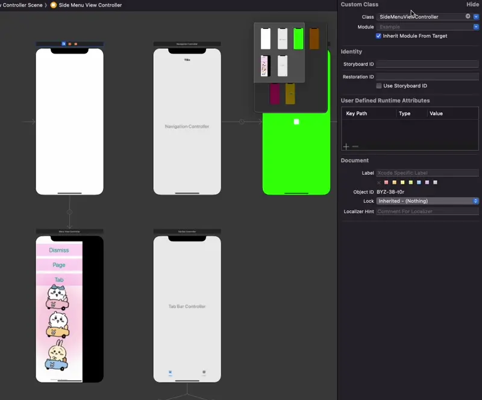

# WWSideMenuViewController

[](https://developer.apple.com/swift/) [](https://developer.apple.com/swift/)  [](https://developer.apple.com/swift/) [](https://developer.apple.com/swift/)

## [Introduction - 簡介](https://swiftpackageindex.com/William-Weng)
- [Customizable side menu of the screen.](https://github.com/kukushi/SideMenu)
- [可以自訂畫面的側邊選單。](https://github.com/William-Weng/Cocoapods)


## [Installation with Swift Package Manager](https://medium.com/彼得潘的-swift-ios-app-開發問題解答集/使用-spm-安裝第三方套件-xcode-11-新功能-2c4ffcf85b4b)
```bash
dependencies: [
    .package(url: "https://github.com/William-Weng/WWSideMenuViewController.git", .upToNextMajor(from: "1.4.0"))
]
```

## [相關設定](https://ezgif.com/video-to-webp)




## 可用函式
|函式|說明|
|-|-|
|initSettingWithSegue(_:displayPosition:visualEffectStyle:delegate:)|初始化設定 (使用Segue)|
|initSettingWithViewController(_:displayPosition:visualEffectStyle:delegate:)|初始化設定 (使用UIViewController)|
|display(with:duration:curve:)|顯示側邊選單|
|dismiss(with:duration:curve:)|隱藏側邊選單|
|backFirstItemViewController(with:duration:curve:)|回到一開始的頁面 (第一頁)|
|changeItemViewController(_:with:duration:curve:)|切換頁面|

## WWSideMenuViewControllerDelegate
|函式|說明|
|-|-|
|sideMenu(_:state:)|側邊選單的動畫狀態|
|sideMenu(_:from:to:)|側邊選單的換頁順序|

## Example
```swift
import UIKit
import WWPrint
import WWSideMenuViewController

final class SideMenuViewController: WWSideMenuViewController {
    
    override func viewDidLoad() {
        super.viewDidLoad()
        initSettingWithSegue(delegate: self)
    }
}

extension SideMenuViewController: WWSideMenuViewControllerDelegate {
    
    func sideMenu(_ sideMenuController: WWSideMenuViewController, state: MenuState) {
        wwPrint(state)
    }
    
    func sideMenu(_ sideMenuController: WWSideMenuViewController, from previousViewController: UIViewController?, to nextViewController: UIViewController) {
        wwPrint("from: \(String(describing: previousViewController)) to: \(nextViewController)")
    }
}
```
```swift
import UIKit
import WWSideMenuViewController

class MenuViewController: WWMenuViewController {
    
    lazy var tabViewController: UIViewController = { self.storyboard!.instantiateViewController(withIdentifier: "Tab") }()
    
    override func touchesBegan(_ touches: Set<UITouch>, with event: UIEvent?) {
        super.touchesBegan(touches, with: event)
        _ = dismiss()
    }
    
    @IBAction func dimissMenu(_ sender: UIButton) { _ = dismiss() }
    @IBAction func changePageViewController(_ sender: UIButton) { _ = backFirstItemViewController() }
    @IBAction func changeTabViewController(_ sender: UIButton) { _ = changeItemViewController(tabViewController) }
}
```
```swift
import UIKit
import WWSideMenuViewController

class Page1ViewController: WWItemViewController {
    @IBAction func diplayMenu(_ sender: UIBarButtonItem) { _ = display() }
}

class Tab1ViewController: WWItemViewController {
    @IBAction func diplayMenu(_ sender: UIButton) { _ = display() }
}

class Tab2ViewController: WWItemViewController {
    @IBAction func diplayMenu(_ sender: UIButton) { _ = display() }
}
```
